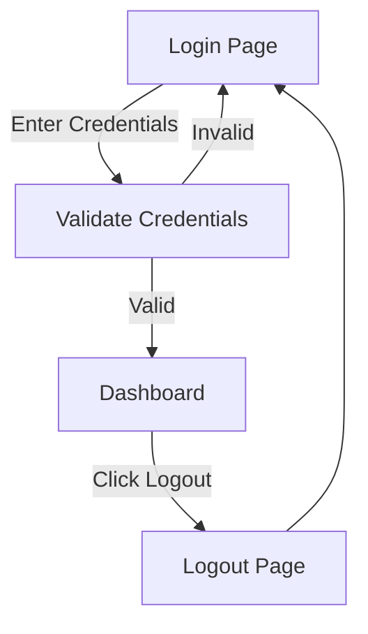
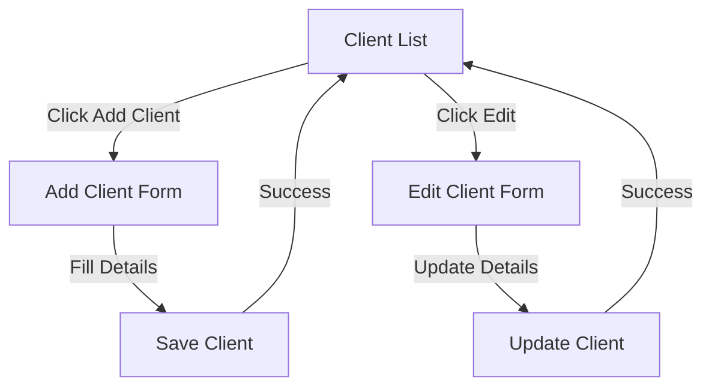
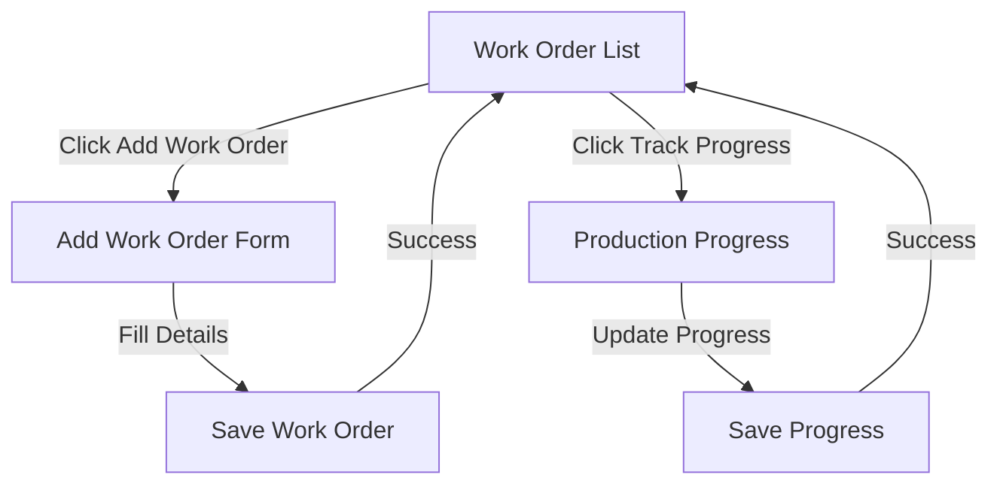
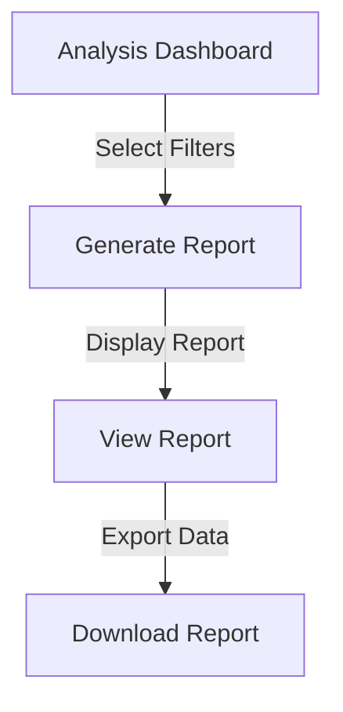

---

# **KisWebApp UI Documentation**

## **Table of Contents**
1. [Introduction](#introduction)
2. [Authentication](#authentication)
3. [Dashboard](#dashboard)
4. [Client Management](#client-management)
5. [Production & Work Orders](#production--work-orders)
6. [Analysis & Reporting](#analysis--reporting)
7. [User Workflows](#user-workflows)
   - [Authentication Flow](#authentication-flow)
   - [Client Management Flow](#client-management-flow)
   - [Production Workflow](#production-workflow)
   - [Analysis Workflow](#analysis-workflow)
8. [Appendix](#appendix)

---

## **Introduction**
This document provides a detailed analysis of the **KisWebApp** UI, including its structure, components, and user workflows. It covers:
- Web Forms (`.aspx`), Codebehind (`.aspx.cs`), User Controls (`.ascx`), and MVC Views (`.cshtml`).
- Key UI components, event handlers, data bindings, and backend interactions.
- User workflows for primary roles (e.g., admin, user, guest).

---

## **Authentication**
### **Files Analyzed**
- `Login/login.aspx` + `Login/login.aspx.cs`
- `Login/Logout.aspx` + `Login/Logout.aspx.cs`
- `Personal/my.aspx` + `Personal/my.aspx.cs`

### **Key UI Components**
| File | Component | Description |
|------|-----------|-------------|
| `login.aspx` | Login Form | Username/password fields, "Remember Me" checkbox, "Login" button. |
| `login.aspx` | Error Messages | Displays validation errors (e.g., invalid credentials). |
| `my.aspx` | User Profile | Displays user details (name, role, last login). |
| `Logout.aspx` | Logout Confirmation | Confirms logout and redirects to login page. |

### **Event Handlers**
| File | Event | Description |
|------|-------|-------------|
| `login.aspx.cs` | `Page_Load` | Initializes the login page. |
| `Logout.aspx.cs` | `Page_Load` | Logs out the user, clears the session, and redirects to the login page. |

### **Data Bindings**
- `login.aspx.cs`: Validates credentials against the database.
- `my.aspx.cs`: Fetches user details from the database.

### **Backend Interactions**
- **Database**: Validates user credentials (`Users` table).
- **Session**: Stores user ID and role for authentication.

---

## **Dashboard**
### **Files Analyzed**
- `HomePage/Default.aspx` + `HomePage/Default.aspx.cs`

### **Key UI Components**
| Component | Description |
|-----------|-------------|
| Navigation Menu | Links to Client Management, Production, Analysis, Admin. |
| Summary Cards | Displays key metrics (e.g., active clients, work orders). |
| Recent Activity | Lists recent actions (e.g., client additions, work order updates). |

### **Event Handlers**
| Event | Description |
|-------|-------------|
| `Page_Load` | Fetches and displays summary metrics and recent activity. |

### **Data Bindings**
- Fetches metrics from `Clients`, `Commesse`, and `Produzione` tables.

### **Backend Interactions**
- **Database**: Queries for summary metrics and recent activity.

---

## **Client Management**
### **Files Analyzed**
- `Clienti/Clienti.aspx` + `Clienti/Clienti.aspx.cs`
- `Clienti/AddCliente.aspx` + `Clienti/AddCliente.aspx.cs`
- `Clienti/EditCliente.aspx` + `Clienti/EditCliente.aspx.cs`
- `Clienti/listClienti.ascx` + `Clienti/listClienti.ascx.cs`
- `Clienti/EditCliente.ascx` + `Clienti/EditCliente.ascx.cs`

### **Key UI Components**
| File | Component | Description |
|------|-----------|-------------|
| `Clienti.aspx` | Client List | Grid displaying clients (name, contact, status). |
| `AddCliente.aspx` | Add Client Form | Fields for name, contact, address, tax ID, etc. |
| `EditCliente.aspx` | Edit Client Form | Pre-filled form for editing client details. |
| `listClienti.ascx` | Client Grid | Reusable grid for displaying clients. |
| `EditCliente.ascx` | Edit Form | Reusable form for editing client details. |

### **Event Handlers**
| File | Event | Description |
|------|-------|-------------|
| `Clienti.aspx.cs` | `Page_Load` | Initializes the client list page. |
| `AddCliente.aspx.cs` | `Page_Load` | Initializes the add client form. |
| `EditCliente.aspx.cs` | `Page_Load` | Loads client details for editing. |
| `listClienti.ascx.cs` | `rpt1_ItemCommand` | Handles row clicks (e.g., edit, delete). |
| `EditCliente.ascx.cs` | `btnSave_Click` | Validates and updates client details in the database. |

### **Data Bindings**
- `Clienti.aspx.cs`: Fetches clients from the `Clienti` table.
- `AddCliente.aspx.cs`: Saves new client to the `Clienti` table.
- `EditCliente.aspx.cs`: Updates client details in the `Clienti` table.

### **Backend Interactions**
- **Database**: Queries and updates the `Clienti` table.

---

## **Production & Work Orders**
### **Files Analyzed**
- `Commesse/commesse.aspx` + `Commesse/commesse.aspx.cs`
- `Commesse/wzAddCommessa.aspx` + `Commesse/wzAddCommessa.aspx.cs`
- `Produzione/avanzamentoProduzione.aspx` + `Produzione/avanzamentoProduzione.aspx.cs`
- `Commesse/listCommesse.ascx` + `Commesse/listCommesse.ascx.cs`

### **Key UI Components**
| File | Component | Description |
|------|-----------|-------------|
| `commesse.aspx` | Work Order List | Grid displaying work orders (ID, client, status, deadline). |
| `wzAddCommessa.aspx` | Add Work Order Form | Fields for client, product, quantity, deadline, etc. |
| `avanzamentoProduzione.aspx` | Production Progress | Tracks progress of work orders (e.g., % complete). |
| `listCommesse.ascx` | Work Order Grid | Reusable grid for displaying work orders. |

### **Event Handlers**
| File | Event | Description |
|------|-------|-------------|
| `commesse.aspx.cs` | `Page_Load` | Initializes the work order list page. |
| `wzAddCommessa.aspx.cs` | `Page_Load` | Initializes the add work order form. |
| `avanzamentoProduzione.aspx.cs` | `Page_Load` | Loads production progress data. |
| `listCommesse.ascx.cs` | `rptCommesse_ItemCommand` | Handles row clicks (e.g., edit, delete). |
| `avanzamentoProduzione.aspx.cs` | `TimeCheck_Tick` | Updates production progress at regular intervals. |

### **Data Bindings**
- `commesse.aspx.cs`: Fetches work orders from the `Commesse` table.
- `wzAddCommessa.aspx.cs`: Saves new work order to the `Commesse` table.
- `avanzamentoProduzione.aspx.cs`: Updates progress in the `Produzione` table.

### **Backend Interactions**
- **Database**: Queries and updates `Commesse` and `Produzione` tables.

---

## **Analysis & Reporting**
### **Files Analyzed**
- `Analysis/analysis.aspx` + `Analysis/analysis.aspx.cs`
- `Analysis/CustomerPortfolio.aspx` + `Analysis/CustomerPortfolio.aspx.cs`
- `Analysis/ListAnalysisOperatori.ascx` + `Analysis/ListAnalysisOperatori.ascx.cs`

### **Key UI Components**
| File | Component | Description |
|------|-----------|-------------|
| `analysis.aspx` | Analysis Dashboard | Filters and displays analysis reports (e.g., productivity, workload). |
| `CustomerPortfolio.aspx` | Customer Portfolio | Displays customer metrics (e.g., revenue, order history). |
| `ListAnalysisOperatori.ascx` | Operator Analysis Grid | Reusable grid for displaying operator productivity. |

### **Event Handlers**
| File | Event | Description |
|------|-------|-------------|
| `analysis.aspx.cs` | `Page_Load` | Initializes the analysis dashboard. |
| `CustomerPortfolio.aspx.cs` | `Page_Load` | Fetches and displays customer portfolio data. |
| `ListAnalysisOperatori.ascx.cs` | `Page_Load` | Loads operator data for analysis. |

### **Data Bindings**
- `analysis.aspx.cs`: Fetches data from `Produzione`, `Commesse`, and `Clienti` tables.
- `CustomerPortfolio.aspx.cs`: Fetches customer metrics from `Clienti` and `Commesse` tables.

### **Backend Interactions**
- **Database**: Queries `Produzione`, `Commesse`, and `Clienti` tables for analysis.

---

## **User Workflows**
### **Authentication Flow**

### **Client Management Flow**

### **Production Workflow**

### **Analysis Workflow**

---

## **Appendix**
### **File Inventory**
| Module | File | Type | Description |
|--------|------|------|-------------|
| Authentication | `Default.aspx` | Web Form | Homepage after login. |
| Authentication | `login.aspx` | Web Form | Login page. |
| Authentication | `Logout.aspx` | Web Form | Logout confirmation. |
| Authentication | `my.aspx` | Web Form | User profile. |
| Dashboard | `Default.aspx` | Web Form | Dashboard with summary metrics. |
| Client Management | `Clienti.aspx` | Web Form | Client list. |
| Client Management | `AddCliente.aspx` | Web Form | Add client form. |
| Client Management | `EditCliente.aspx` | Web Form | Edit client form. |
| Production | `commesse.aspx` | Web Form | Work order list. |
| Production | `wzAddCommessa.aspx` | Web Form | Add work order form. |
| Production | `avanzamentoProduzione.aspx` | Web Form | Track production progress. |
| Analysis | `analysis.aspx` | Web Form | Analysis dashboard. |
| Analysis | `CustomerPortfolio.aspx` | Web Form | Customer portfolio. |

### **Glossary**
- **Web Form (`.aspx`)**: Defines the structure and layout of a page.
- **Codebehind (`.aspx.cs`)**: Contains server-side logic for a Web Form.
- **User Control (`.ascx`)**: Reusable UI component embedded in Web Forms.
- **MVC View (`.cshtml`)**: Razor view for MVC portions of the app.
